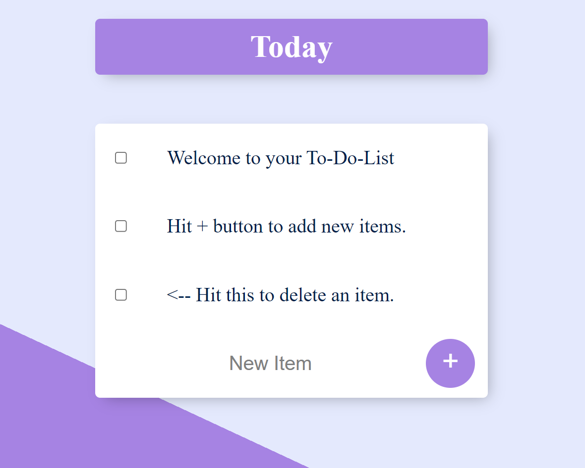

<h1>To Do List</h1>
<h3>This is a simple To Do List web application built using HTML, CSS, JavaScript, Node.js and MongoDB.
The application allows users to create and manage their personal to-do lists.</h3>

<h2>Features</h2>
<ul>
<li>Create new to-do items</li>
<li>Edit existing to-do items</li>
<li>Mark to-do items as complete</li>
<li>Delete to-do items</li>
<li>Persist to-do items in a MongoDB database</li>

</ul>

<h2>Getting Started</h2>
<h3>These instructions will get you a copy of the project up and running on your local machine for development and testing purposes.</h3>

<h2>Prerequisites</h2>
<ul>
<li>Node.js and npm</li>
<li>MongoDB</li>

</ul>

<h2>Installation</h2>
<ol>
<li>Clone the repository</li>
<li>Install the dependencies: npm install</li>
<li>Start the MongoDB server: mongod</li>
<li>Start the application: npm start</li>
<li>Open the application in your browser: http://localhost:3000</li>

</ol>

<h2>Built With</h2>
<ul>
<li>HTML</li>
<li>CSS</li>
<li>JavaScript</li>
<li>Node.js</li>
<li>
MongoDB</li>

</ul>

